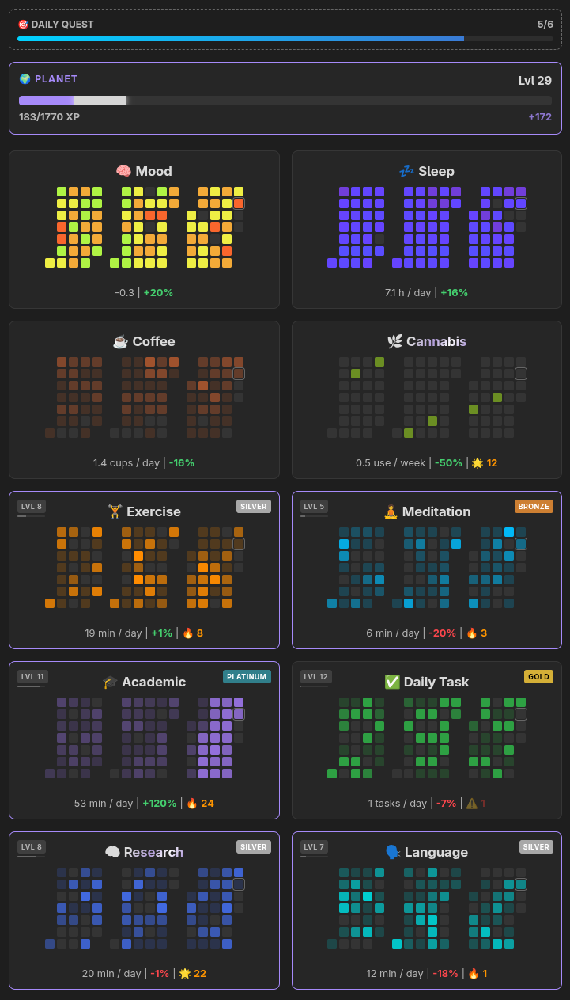

# Obsidian Habit Heatmap

A visual, gamified dashboard for tracking habits and life stats directly from your Daily Notes.



## Features
- **GitHub-Style Heatmaps**: Visual 90-day history for every stat.
- **Gamified Progression**: Earn XP and level up your habits.
- **Competitive Ranks**: Tiered ranking system (Iron to Diamond) based on 90-day performance.
- **Daily Quests**: Visual progress bar for your daily habit completion.
- **Smart Data**: Automatic sanitization and default values for missing logs.

## Planned
- Configuration menu instead of YAML
- Remove Dataview dependency
- Interactive data logging from dashboard
- Unlock achievements for milestones
- Submit

## Prerequisites
- **Dataview Plugin**: Must be installed and enabled.

## Installation
1. Create a folder: `YourVault/.obsidian/plugins/habit-heatmap/`
2. Copy release files into folder and unzip (or clone repo and run `npm run dev` for live env)
3. Enable the plugin in Obsidian settings.

## Usage
Insert this code block into any note. 

### Dashboard Example
```yaml
```habit-heatmap
FOLDER: '"100 Journal"'
XP_SETTINGS: { globalFactor: 30, treeFactor: 50 }

STATS:
  - { prop: "mood", type: "metric", dataType: "rating", title: "🧠 Mood", streakType: "none", boundaries: { min: 1, default: 4, max: 7 }, color: { type: "absolute", palette: ["#ff2222", "#eeee44", "#33ff44"] } }
  - { prop: "exercise", type: "habit", dataType: "time", title: "🏋️ Exercise", streakType: "positive", unit: "min", freq: "day", boundaries: { min: 0, default: 0, max: 1440 }, mastery: 60, xp: { type: "linear", div: 1 }, color: { type: "relative", rgb: "255, 140, 0" } }
  - { prop: "cannabis", type: "metric", dataType: "amount", title: "🌿 Cannabis", streakType: "negative", goal: "down", unit: "use", freq: "week", boundaries: { min: 0, default: 0, max: 99 }, color: { type: "relative", rgb: "107, 142, 35" } }
```
```

### Daily Note Example 
The plugin reads from the frontmatter of your daily notes:
```markdown
---
mood: 5
exercise: 45
cannabis: 1
---
```

### Dashboard Stat Configuration Reference

Each item in the `STATS` list defines how a specific piece of data is processed and displayed.

| Property | Description |
| :--- | :--- |
| `prop` | The key used in your Daily Note frontmatter (e.g., `exercise`). |
| `type` | `habit` (shows level/rank/XP) or `metric` (info-only card). |
| `dataType` | `rating` (centered at default), `time` (mins/hours), or `amount` (counts). |
| `title` | The display name shown at the top of the card. |
| `streakType` | `positive` (log > 0), `negative` (log = 0), or `none`. |
| `goal` | `up` or `down`. Determines if a positive trend shows as green or red. |
| `unit` | The label for your data (e.g., `min`, `h`, `score`). |
| `freq` | `day` or `week`. Weekly scales daily averages by 7 in tooltips. |
| `boundaries` | Defines `min`, `max`, and the `default` value used if a day is blank. |
| `mastery` | The daily average required to reach the "Diamond" rank. |
| `xp` | Configures XP gain (e.g., `{ type: "linear", div: 1 }`). |
| `color` | `absolute` (uses a 3-color palette) or `relative` (uses RGB + opacity). |

**Note on Boundaries:** The `default` value acts as your baseline. For ratings (like Mood), the UI will show `+` or `-` relative to this number.
For all stats, the engine uses this value to fill in gaps for days you forgot to log.